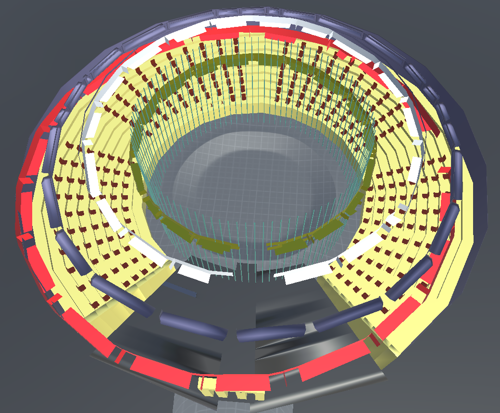
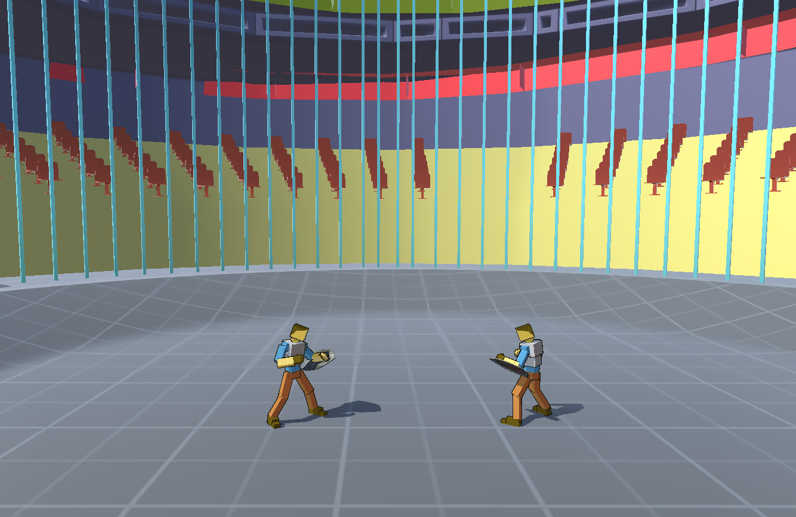
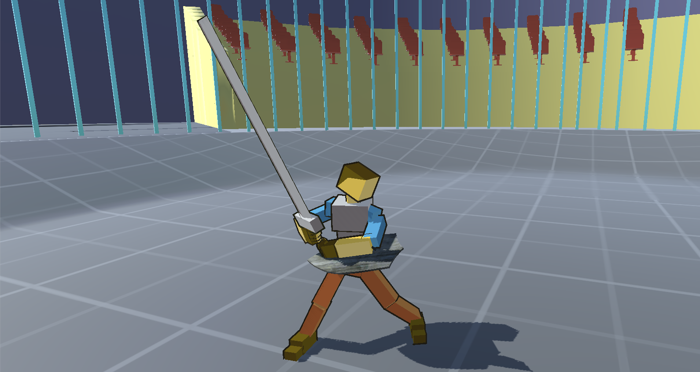
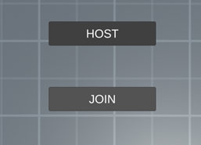

# Fight! — 3D мультиплеерный файтинг (курсовая)

Сетевой файтинг от третьего лица на **Unity 6** и **Mirror**: один игрок создаёт матч, второй подключается по локальной сети.

## Что внутри

- Сетевая часть на Mirror (KCP-транспорт): хост/подключение, синхронизация игроков, анимаций и интерфейса
- **Серверная боевая логика**: урон, блок щитом, здоровье, смерть и победа последнего выжившего — через `Command` / `ClientRpc` / `SyncVar`
- **Лобби**: хост/подключение с обработкой ошибок сети, круговое распределение точек спавна, рестарт матча и возврат в лобби
- **Боёвка на Rigidbody**: движение, прыжок с рывком, меч / кулаки, партиклы попаданий, тряска камеры
- Анимации персонажа на Animation Events, синхронизированные через `NetworkAnimator`
- Кроссплатформенный ввод: клавиатура (PC)
- HUD: полоски здоровья игроков, статистика побед/поражений (`PlayerPrefs`)

## Скриншоты

  
  

  

## Технологии

Unity 6000.3.10f1 · C# · Mirror (KCP) · Rigidbody · TextMeshPro

## Запуск

1. Открыть проект в Unity 6 (6000.3.10f1 или новее)
2. Открыть сцену меню и нажать **Play** — Host или Join
3. Для игры по сети: собрать билд под Windows и подключить устройства к одной локальной сети

---
Автор: Максим Семёнов
