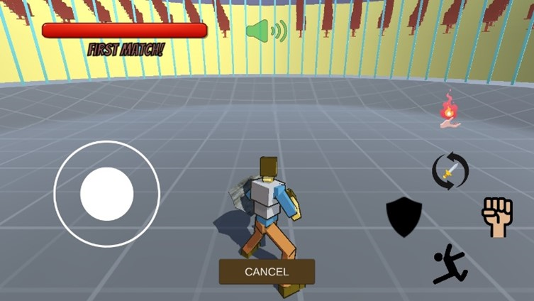

# Fight! — 3D Multiplayer Fighting Game (Course Rework)

A 3D third-person multiplayer fighting game built with **Unity 6** and **Mirror** networking. One player hosts, the other joins over LAN — fight on PC or Android.

Based on the open-source [Fight! project by Partha-Sarker](https://github.com/Partha-Sarker/Fighting-Game-3d-Multiplayer-Unity3d) (originally built on the legacy UNet API). This is my coursework rework of the project:

- Migrated networking from legacy UNet to **Mirror (KCP transport)**
- Reworked combat to run **server-side** — damage, shield blocking, death and last-man-standing win detection via `Command` / `ClientRpc` / `SyncVar`
- Reworked lobby: host/join UI with connection error handling, round-robin spawn points, match restart and return to lobby
- Cross-platform input: keyboard (PC) + virtual joystick (Android)
- Character animations driven by Animation Events, synced over the network with `NetworkAnimator`
- Player HUD with health bars and win/lose ratio (persisted with `PlayerPrefs`)

## Screenshots

  
  

  
  

## Tech

- Unity 6000.3.10f1, C#
- Mirror (KCP transport)
- Rigidbody-based movement and jump-dash
- TextMeshPro UI

## How to run

1. Open the project in Unity 6 (6000.3.10f1 or newer)
2. Open the menu scene and press **Play** — Host or Join
3. For real multiplayer: build for Windows/Android and connect both devices to the same local network

## Credits

Original game — [Partha-Sarker](https://github.com/Partha-Sarker/Fighting-Game-3d-Multiplayer-Unity3d).
UNet → Mirror migration, server-side combat rework, lobby and input improvements — Maxim Semenov.
